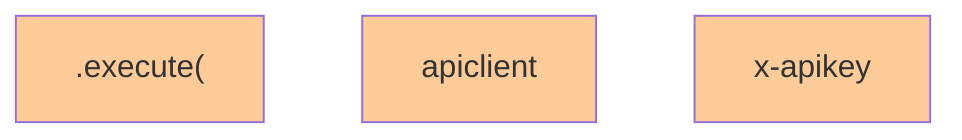

# API Dependency Analysis Report

**Repository:** https://github.com/ingka-group-digital/cssom-infrastructure
**Analysis Date:** 2025-07-25 14:25:33

## Summary
- Files analyzed: 1
- Unique APIs found: 16
- Total API calls: 22

## API Architectural Tiers

| Tier | API Category | APIs | Usage Count | Dependencies |
|------|--------------|------|-------------|-------------|
| 4 | Business Core | .execute( (4), apiclient (2), 'x-apikey' (2), get (2), "

import os
import json
import logging
import requests
import googleapiclient.discovery
import datetime
import sys
from pythonjsonlogger import jsonlogger
from dotenv import load_dotenv
from google.cloud import secretmanager

# Load the environment variables from .env file
load_dotenv()

# Verify all nescessary variables are set
MANDATORY_ENV_VARS = [" (1) | - | Tier 3 |

## Mermaid Dependency Diagram

