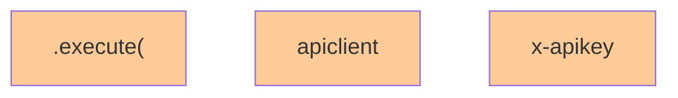

# API Dependency Diagram

## How to View:
1. This file should automatically show the Mermaid diagram with the installed extensions
2. You can also use Ctrl+Shift+P (Cmd+Shift+P on Mac) and type "Mermaid" to see preview options
3. Or right-click and look for Mermaid preview options
